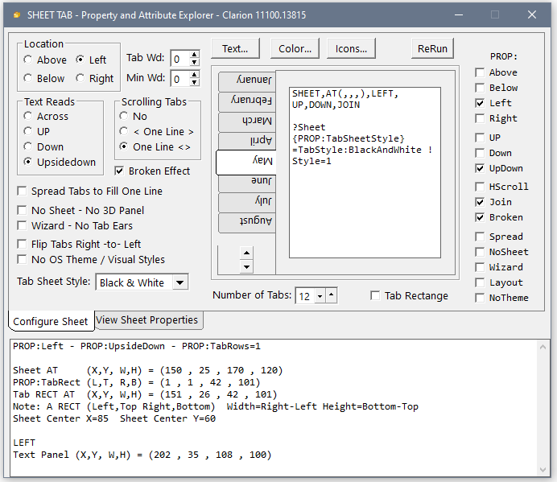
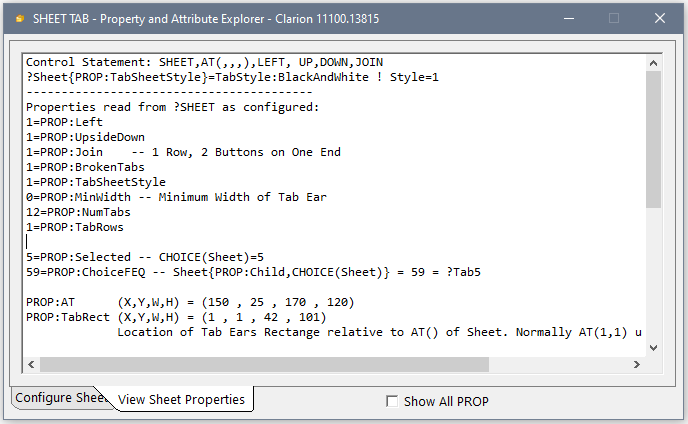
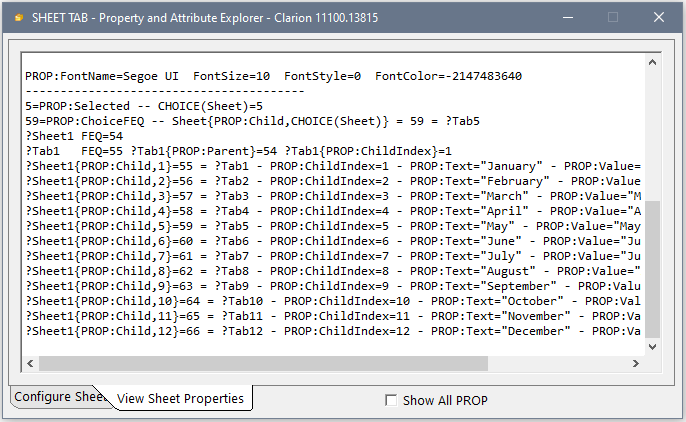

## SHEET-TAB-PROP - Sheet Tab Property and Attribute Explorer

 The SHEET and TAB control has many Attributes and Properties that allow configuring dozens of ways. The IDE Window Designer has all the attributes but does not always render the control correctly. The only way to see the Sheet accurately is to preview the window.

 This tool allows you to configure all the Sheet attributes and see a Preview Sheet change live. It also allows configuring several properties ( PROP: ) which is not possible with Designer.

 In the middle of the preview Sheet the Window code shows e.g. below ```SHEET,AT(,,,),LEFT, UP,DOWN,JOIN ```

It also shows any properties set e.g. the Tab Ear style was set below toi Offer 2003 Black & White with: ```?Sheet{PROP:TabSheetStyle}=TabStyle:BlackAndWhite ! Style=1```



At the bottom I work out the position of the Tab rectange and the client rectange which is used to resize a text control with the Sheet Code.

### Properties of Sheet

On the “View Sheet Poperties” tab the Tool also allows viewing all the runtime PROP:’s you can access:





### Code Snips for Sheet and Tab

The index number (1,2,3,...) of the selected Tab is returned by ```CHOICE(?Sheet)```. If a Tab is inserted or deleted the index numbers of the subsequent tabs will change which makes using CHOICE() problematic for Tab specific code, the code will no longer execute for the correct tab.

 A better way to code for tab selected is property ```?Sheet{PROP:ChoiceFEQ}``` that returns the choice Tab's FEQ. So code like ```IF Choice(?Sheet)=4``` can be written ```IF ?Sheet{PROP:ChoiceFEQ}=?Tab:4``` . Note: it's best to change the default Tab FEQ labels like ?Tab:4 to something meaningful like ?Tab:ByState.

 There are reports of PROP:ChoiceFEQ not working for a Sheet on a Toolbar. An alternative that proved to work was ```?Sheet{PROP:Child, CHOICE(?Sheet)}``` . The Child property ```Parent{PROP:Child, Child Index}``` returns the FEQ of the child control and works for Sheets, Tabs, Options, Groups and Windows. The inverse ```?Tab{PROP:ChildIndex}``` returns a Tab's index number on the Sheet.

 PROP:Child plus PROP:NumTabs are useful to iterrate through all the Tabs on a Sheet using this code:
```Clarion
 TabNdx   USHORT
 TabFEQ   LONG
   CODE
   LOOP TabNdx=1 TO ?Sheet{PROP:NumTabs}
        TabFEQ=?Sheet{PROP:Child, TabNdx}  
        IF TabFEQ{PROP:Hide} THEN CYCLE.
        TabFEQ{PROP:Tip}='Tab Tip for #' & TabNdx
   END
   ```
